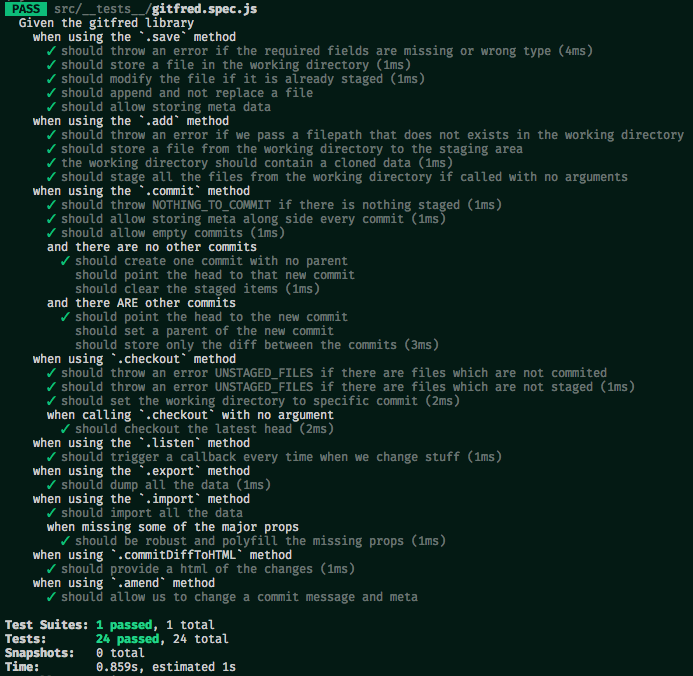

# Gitfred

In-memory git-like library for managing textual content

[Demo https://demoit.app/e/ZLXBJMGKxiP](https://demoit.app/e/ZLXBJMGKxiP)

## Installation

`npm install gitfred` / `yarn add gitfred`

or directly using [https://unpkg.com/gitfred](https://unpkg.com/gitfred)

## Usage

```js
const git = gitfred();

git.save({ filepath: "foo.js", content: "hello world" });
```

We have no commits yet, but we have our file in the working directory. If we run `git.export()` we'll see the following:

```json
{
  "commits": {},
  "stage": {},
  "working": {
    "foo.js": {
      "content": "hello world"
    }
  },
  "head": null
}
```

Let's stage our file.

```js
git.add('foo.js');
```

No we have our file staged. The working directory and our staging area contain the same information.

```json
{
  "commits": {},
  "stage": {
    "foo.js": {
      "content": "hello world"
    }
  },
  "working": {
    "foo.js": {
      "content": "hello world"
    }
  },
  "head": null
}
```

Let's make our first commit:

```js
git.commit('first commit');
```

We just created a new commit with a hash equal to `_1`. There is nothing in our staging area and `head` now points to our first commit.

```json
{
  "commits": {
    "_1": {
      "message": "first commit",
      "parent": null,
      "files": "{\"foo.js\":{\"content\":\"hello world\"}}"
    }
  },
  "stage": {},
  "working": {
    "foo.js": {
      "content": "hello world"
    }
  },
  "head": "_1"
}
```

We'll continue by editing our file and making another commit.

```js
git.save({ filepath: "foo.js", content: "winter is coming" });
git.add('foo.js');
git.commit('second commit');
```

There are two commits now and `head` points to the second one (with a hash of `_2`).

```json
{
  "commits": {
    "_1": {
      "message": "first commit",
      "parent": null,
      "files": "{\"foo.js\":{\"content\":\"hello world\"}}"
    },
    "_2": {
      "message": "second commit",
      "parent": "_1",
      "files": "@@ -19,18 +19,24 @@\n t%22:%22\n-hello world\n+winter is coming\n %22%7D%7D\n"
    }
  },
  "stage": {},
  "working": {
    "foo.js": {
      "content": "winter is coming"
    }
  },
  "head": "_2"
}
```

Also notice that the second commit does not contain the whole file but a patch on top of the first commit.

We may now go back to our first commit:

```js
git.checkout('_1');
```

The head again points to `_1` and our working directory contains also the files from that first commit.

```json
{
  "i": 2,
  "commits": {
    "_1": {
      "message": "first commit",
      "parent": null,
      "files": "{\"foo.js\":{\"content\":\"hello world\"}}"
    },
    "_2": {
      "message": "second commit",
      "parent": "_1",
      "files": "@@ -19,18 +19,24 @@\n t%22:%22\n-hello world\n+winter is coming\n %22%7D%7D\n"
    }
  },
  "stage": {},
  "working": {
    "foo.js": {
      "content": "hello world"
    }
  },
  "head": "_1"
}
```

## API

*Methods:*

* `save({ filepath:string, ...whatever })` - saves a file in the working directory
* `del({ filepath:string })` - deletes a file from the working directory
* `rename(oldFilepath:string, newFilepath:string)` - renames a file in the working directory
* `add(filepath:string)` - stage the current chnages
* `commit(message:string, meta:any):<hash:string>` - `meta` is optional. Commit.
* `amend(hash:string, message:string, meta:any):<hash:string>` - `meta` is optional. Edit commit message and `meta`.
* `show(hash:string):<commit:object>` - get a single commit.
* `checkout(hash:string, force:boolean)` - `force` is by default `false`. Checkout to a specific commit.
* `staged():<staging area:object>` - get what's staged.
* `working():<working directory:object>` - get what's in the working directory.
* `head():<hash:string>` - see the hash of the commit where the head points to.
* `log():<all commits:object>` - get all the commits.
* `export():<all data:object>` - get all the data of gitfred
* `import(data:object)` - restore a gitfred state. Check out what `exports` returns.
* `listen(callback:function)` - listen for changes in the data. Check the static vars below to see what is your callback fired with.
* `commitDiffToHTML(hash:string):<html:string>` - in case you need to show what a specific commit is doing.

*Static vars:*

* `git.ON_SAVE` - send to the listener passed to `listen` method
* `git.ON_ADD` - send to the listener passed to `listen` method
* `git.ON_COMMIT` - send to the listener passed to `listen` method
* `git.ON_CHECKOUT` - send to the listener passed to `listen` method

## Scripts

* `yarn release` - building the library
* `yarn test` - running the tests once
* `yarn dev` - running the tests in a *watch* mode

## Tests


